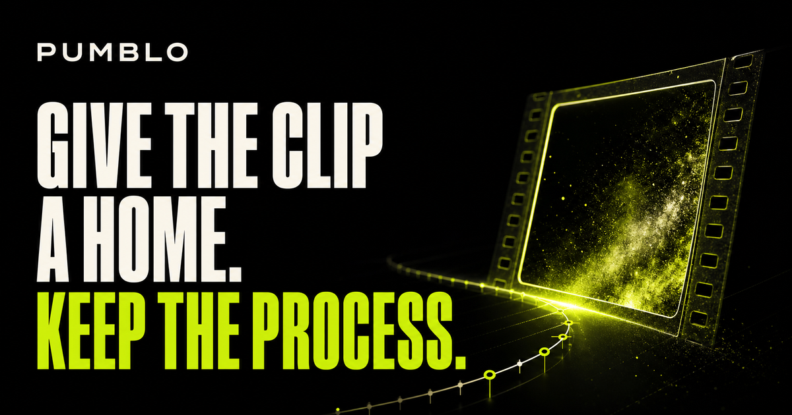
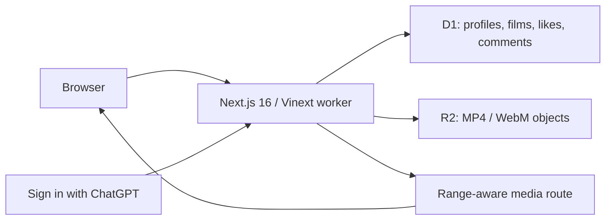

<div align="center">
  <h1>🎬 Pumblo</h1>
  <p><strong>Give the clip a home. Keep the process.</strong></p>
  <p>Shareable film pages for AI motion creators—with the tools, workflow, license, creator profile, and feedback attached.</p>

  [](https://www.typescriptlang.org/)
  [](LICENSE)
  [](https://github.com/IamOumarIbrahim/pumblo/actions/workflows/ci.yml)
  <br />
  [](https://nextjs.org/)
  [](https://github.com/cloudflare/vinext)
  [](#-setup--installation)
  <br />
  <strong><a href="https://pumblo-ai-video.oumaribrahim123.chatgpt.site">Open the live app</a></strong>
</div>

<p align="center">
  
</p>

> [!IMPORTANT]
> **No card setup.** Local development needs no API key or hosted database account. The configured Sites deployment supplies production authentication plus managed D1 and R2 bindings.

Pumblo is for AI filmmakers, animators, music-visual creators, and small studios who already have a finished clip but need a link worth sharing. It turns that render into a public film page and keeps its creative recipe beside it. Viewers can watch without an account; creators only sign in when they want to publish, like, or comment.

```powershell
# Quickstart—Windows PowerShell
git clone https://github.com/IamOumarIbrahim/pumblo.git
cd pumblo
.\scripts\setup.ps1
npm run dev
```

## 📖 Table of Contents

- [Why Pumblo?](#-why-pumblo)
- [Key Features](#-key-features)
- [System Architecture](#️-system-architecture)
- [Setup & Installation](#-setup--installation)
- [How to Use](#️-how-to-use)
- [Product Gates](#-product-gates)
- [Runtime Reference](#-runtime-reference)
- [Scope & Limitations](#-scope--limitations)
- [File Structure](#-file-structure)
- [Troubleshooting](#-troubleshooting)
- [Contributing](#-contributing)
- [License](#-license)

---

## 💡 Why Pumblo?

A raw file has no context. A general social post quickly separates the clip from its workflow, usage rights, and useful feedback. Pumblo gives each film a permanent, watchable page with:

- **A cross-tool process card**: name any model, tool, ComfyUI graph, or hybrid pipeline.
- **A creator page**: one public profile collects the work without requiring a follower base.
- **A feedback address**: likes and comments stay attached to the film's canonical link.
- **Honest disclosure**: process details are creator-declared, never presented as forensic proof.

The first upload must be useful before a feed has an audience. That cold-start rule is the product strategy, not just launch copy.

---

## ✨ Key Features

- 👤 **Fast creator setup**: handle and display name are the only required profile fields; a handle is suggested automatically.
- ⬆️ **Streaming uploads**: browser-ready MP4/WebM files up to 90 MB stream into R2 without multipart buffering.
- ▶️ **Seekable playback**: `/media/:id` supports HTTP range responses.
- 🧰 **Tool-neutral process notes**: free-text tool input, five workflow modes, license selection, and optional prompt/process notes.
- 🔗 **Share-ready pages**: canonical metadata, Open Graph artwork, native sharing with clipboard fallback, sitemap, and robots rules.
- 💬 **Community actions**: one persisted like per person/video and comments up to 500 characters.
- 🔎 **Transparent discovery**: search, category filters, newest order, or a documented community-signal order.
- 🔐 **Private identity**: the authenticated email is never rendered on public profile or film pages.

---

## ⚙️ System Architecture

The browser talks to one edge worker. The hosting platform supplies identity and durable bindings.



> [!NOTE]
> **Why the raw upload body?** Validated metadata travels in a bounded request header while the video body streams to object storage. The worker does not first buffer a multipart video.

See [`docs/architecture.md`](docs/architecture.md) for the trust boundary and data path.

---

## 🚀 Setup & Installation

### Option A: Automated setup

Windows PowerShell:

```powershell
.\scripts\setup.ps1
```

macOS / Linux:

```bash
chmod +x scripts/setup.sh
./scripts/setup.sh
```

Both scripts check Node.js, install the lockfile, run every release gate, and create a production build.

### Option B: Manual installation

Requirements: Node.js 22.13 or newer and npm.

```bash
npm ci
npm run verify
npm run dev
```

No `.env` file is required. Local D1/R2 state is kept under this repository's `.wrangler/` directory.

🔍 **Verification command**

```bash
npm run verify
```

Expected result: ESLint, TypeScript, release-contract tests, ranking unit tests, the production dependency audit, and the Vinext production build all pass.

### Production deployment

The checked-in [`.openai/hosting.json`](.openai/hosting.json) is already associated with the Pumblo Sites project and declares D1 as `DB` and R2 as `MEDIA`. Deploy through Codex Sites; no registrar, database, storage, OAuth-app, or payment-card setup is part of this path.

Current production app: **[pumblo-ai-video.oumaribrahim123.chatgpt.site](https://pumblo-ai-video.oumaribrahim123.chatgpt.site)**

---

## 🖥️ How to Use

1. Browse films without signing in.
2. Choose **Create a film page** and authenticate with ChatGPT.
3. Accept the suggested handle or change it; optional profile fields can wait.
4. Upload a browser-ready MP4/WebM and add its tool, workflow, license, and optional process notes.
5. Share the watch page. Viewers need an account only to like or comment.

For a local two-person acceptance test, start the app and switch identities with:

```text
http://localhost:3000/api/dev-session?email=alice@example.test
http://localhost:3000/api/dev-session?email=bob@example.test
```

The helper route returns `404` outside development.

---

## 🚪 Product Gates

Every market-facing change must survive one blunt question: **“Bro, who's even gonna use this?”**

| Gate | Shipping test |
| :--- | :--- |
| Named audience | Can we name a creator and the moment they need Pumblo? |
| Single-player value | Is the first film page useful with zero followers? |
| Low friction | Can a viewer watch without an account and a creator publish without third-party setup? |
| Honest trust | Are claims limited to what the system actually observes? |
| Distribution | Does every film produce a canonical, shareable link? |
| Evidence | Do code tests enforce the promise and does the production smoke test pass? |

The full pass/fail rubric is in [`docs/PRODUCT-GATES.md`](docs/PRODUCT-GATES.md). Checked claims and source links are in [`docs/FACT-CHECK.md`](docs/FACT-CHECK.md).

### Community order

Discovery uses visible community activity instead of a fabricated quality grade:

```text
community points = 6 × likes + 4 × comments + 0.05 × min(views, 500)
```

Newest publication time breaks ties. This is a discovery heuristic, not a judgment of artistic quality.

---

## 📊 Runtime Reference

| Resource | Limit / behavior | Purpose |
| :--- | :--- | :--- |
| Profiles | No application-level signup cap | Removes an artificial growth barrier |
| Films | 5 per creator | Conservative storage guard |
| Film file | MP4 or WebM, 90 MB maximum | Browser-ready source; no transcoding |
| Database | D1 binding `DB` | Profiles, metadata, likes, comments, views |
| Media | R2 binding `MEDIA` | Durable objects and range reads |
| Authentication | Sign in with ChatGPT | Required for writes, never for viewing |
| Process status | `creator-declared` in the UI | Disclosure, not cryptographic verification |

Public HTTP endpoints are documented in [`docs/api.md`](docs/api.md).

---

## 🔬 Scope & Limitations

- **No uptime SLA**: availability and quotas remain subject to the hosting service.
- **No transcoding or thumbnails**: upload a browser-compatible H.264 MP4 or WebM; the original object is served.
- **No cryptographic provenance**: Pumblo does not validate C2PA Content Credentials or prove where pixels came from.
- **No automated moderation pipeline**: the current policy and authenticated writes are not enough for a large untrusted launch.
- **No creator analytics yet**: view, like, and comment counts are public, but there is no private dashboard.
- **One production identity provider**: writes currently require a ChatGPT account.

The first-ten-user target is a launch capacity goal, not a signup wall or a promise of permanent free hosting.

---

## 📁 File Structure

```text
pumblo/
├── .openai/hosting.json       - Sites project and D1/R2 declarations
├── app/                       - UI, metadata, authentication, and HTTP routes
│   ├── api/                   - Profile, film, like, and comment writes
│   ├── media/[id]/            - Range-aware film delivery
│   ├── profile/[handle]/      - Public creator pages
│   ├── upload/                - Publishing flow
│   └── watch/[id]/            - Film, process, sharing, and conversation
├── db/                        - D1 schema and persistence functions
├── docs/                      - Architecture, facts, gates, API, and policy
├── drizzle/                   - Packaged database migrations
├── public/og.png              - 1200 × 630 social card
├── scripts/                   - Automated Windows and POSIX setup
├── tests/                     - Product contracts and ranking unit tests
└── worker/                    - Vinext worker entry point
```

---

## 🩹 Troubleshooting

| Issue | Root cause | Resolution |
| :--- | :--- | :--- |
| Node version error | Runtime is older than 22.13 | Install current Node.js 22 LTS or newer and rerun setup |
| Port 3000 is occupied | Another local app is listening | Run `npm run dev -- --port 3001` |
| Upload is rejected | Missing profile, wrong format, or over 90 MB | Create a profile and export browser-ready MP4/WebM below the limit |
| Production asks for sign-in | The action changes data | Authenticate, then return to the action |
| Local state should be reset | Miniflare persists data | Stop the server and remove only this repo's `.wrangler/` directory |

---

## 🧩 Contributing

Run `npm run verify` before opening a pull request. Useful next contributions include report/appeal workflows, thumbnail generation, creator analytics, accessible player controls, and C2PA inspection with an explicit trust policy.

---

## 📄 License

AGPL-3.0-only © 2026 [Oumar Ibrahim](https://github.com/IamOumarIbrahim)

## 🙏 Powered By

[Next.js](https://nextjs.org/) · [Vinext](https://github.com/cloudflare/vinext) · [Drizzle ORM](https://orm.drizzle.team/) · [Cloudflare D1](https://developers.cloudflare.com/d1/) · [Cloudflare R2](https://developers.cloudflare.com/r2/)

<div align="center">

If Pumblo gives your AI film a better home, a ⭐ helps the next creator find it.

</div>
