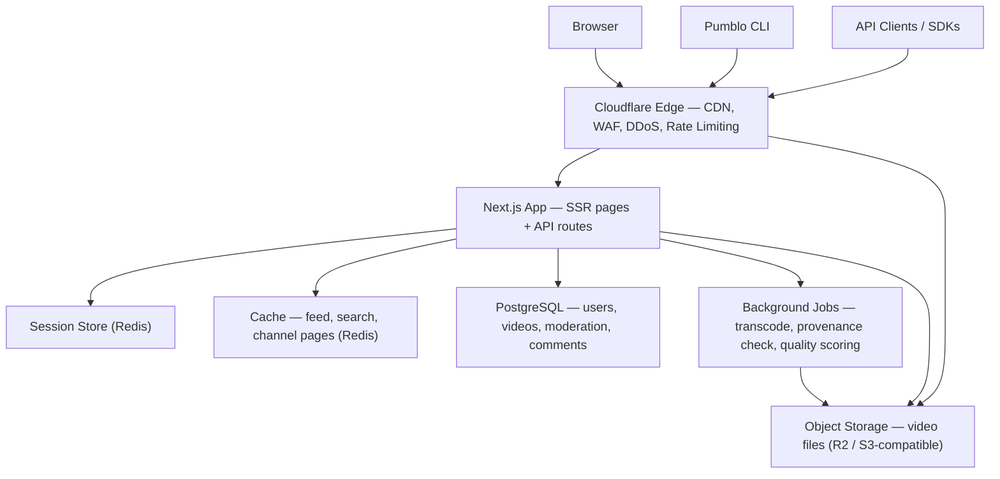

# Pumblo

### The YouTube of AI video.

**Every video is AI-generated. Every account is a real, verified human. Every ranking is earned — never bought.**


🔴 **Live now → [pumblo.ai](https://www.pumblo.ai)** — free to watch, free to join, open-source and self-hostable.


*The Discovery feed — ranked by the Synthesis Quality Score, not by who bought the most bots.*

Pumblo gives AI-generated film, animation, music video, and explainer content the same home YouTube gave camera footage twenty years ago — except every creator is a real, verified person, and every upload says exactly how it was made. Land on Pumblo to watch something great, laugh, learn something, or fall down a feed that was never optimized to waste your time.

- 🎬 **Watch** — no account needed, exactly like YouTube
- 🧑‍🎨 **Upload** — from your browser, an API call, or a one-line shell command
- 🔐 **Trust** — every account is a real person, every video is provably AI

---

## Table of Contents
- [Why Pumblo Exists](#why-pumblo-exists)
- [Who Pumblo Is For](#who-pumblo-is-for)
- [What Pumblo Is (and Isn't)](#what-pumblo-is-and-isnt)
- [How It Works](#how-it-works)
- [Signing Up: Email, Password, Proof of Humanity](#signing-up-email-password-proof-of-humanity)
- [Uploading: Browser, API, or Shell](#uploading-browser-api-or-shell)
- [Security Philosophy](#security-philosophy)
- [Marketing and SEO Philosophy](#marketing-and-seo-philosophy)
- [The Synthesis Quality Score](#the-synthesis-quality-score)
- [Trust, Safety, and Content Policy](#trust-safety-and-content-policy)
- [Handling Many Users at Once](#handling-many-users-at-once)
- [Launch Philosophy: Free to Run, Built to Scale](#launch-philosophy-free-to-run-built-to-scale)
- [Architecture](#architecture)
- [Getting Started (Self-Hosting)](#getting-started-self-hosting)
- [API and CLI Reference](#api-and-cli-reference)
- [Environment Variables](#environment-variables)
- [Repository Structure](#repository-structure)
- [Roadmap](#roadmap)
- [Contributing](#contributing)
- [Code of Conduct and Security Policy](#code-of-conduct-and-security-policy)
- [License](#license)

---

## Why Pumblo Exists

AI-generated video doesn't have a home built for it. It has a moderation category on platforms designed around camera footage — inconsistent labeling, algorithmic suspicion of anything from a known AI creator, and real prompt-craft lumped in with low-effort spam because nothing on those platforms distinguishes the two.

Provenance is a solved problem almost nobody enforces. The C2PA Content Credentials standard already lets a generation tool cryptographically attach "how this was made" to a file. Almost no consumer platform validates that metadata, preserves it through re-encoding, or gives a creator any reason to keep it intact. Pumblo does both — validates it at upload, and rewards keeping it with full ranking weight.

Engagement-optimized ranking rewards the wrong thing. Train a feed to maximize watch time and click-through, and both are trivially inflatable with bots or a misleading thumbnail — quality becomes a losing strategy. It's a well-documented failure mode of nearly every major recommendation system running today. Pumblo's ranking formula deliberately excludes both signals.

Bots hollowed out likes and comments as trust signals. A comment section only means something if a human probably wrote it — on most platforms today, that's not a safe assumption anymore.

Nobody is accountable. Anonymous, disposable, and automated accounts make it trivial to publish and vanish. Pumblo's answer is structural, not a policy promise: one verified human per account, full stop.

## Who Pumblo Is For

- **AI filmmakers and prompt artists** who want an audience that judges the work, not a platform that buries it under a blanket "may be AI-generated" warning.
- **Viewers** who want a feed of genuinely good AI content — shorts, animation, music videos, experimental art — without wading through bot-inflated engagement bait to find it.
- **Educators and explainer creators** using AI video tools, who want to be ranked on clarity and accuracy, not thumbnail psychology.
- **Anyone curious** what AI video actually looks like right now, in one place, instead of scattered across Discord servers and subreddits.

The one-line promise the whole platform is built around: *every video is AI, every account is a real person, and nothing here is trying to waste your time.*

## What Pumblo Is (and Isn't)

**Pumblo is:**
- A consumer video platform for watching AI-generated video — text-to-video, image-to-video, video-to-video, or audio-to-video — laid out the way YouTube is, on purpose, because that's the interaction model people already know.
- Provenance-first: every published video is either cryptographically verified against a C2PA manifest or held for human moderation review before it can reach Discovery.
- Human-accountable: every account belongs to exactly one verified real person, responsible for what they publish.

**Pumblo is not:**
- A video generation tool. Bring a finished render from whatever tool made it — Pumblo doesn't train, host, or run a generative model.
- A home for real camera footage, including AI-upscaled or AI-restored real video. Out of scope, rejected at ingest.
- A place for anonymous or bot-operated accounts. There's no signup path — web or API — that skips human verification.

## How It Works

Pumblo copies the parts of YouTube people already know how to use, and changes only what needed changing.

**Discovery feed** — a single ranked homepage feed, filterable by generation tool/model, category (entertainment, animation, education, music, sci-fi), duration, and license. Toggle between *For You* (personalized within the quality-ranked pool) and *Newest Verified* (strict chronological order among fully provenance-verified uploads).

**Watch page** — familiar player chrome: title, description, likes, comments, related videos — plus a Provenance Panel unique to Pumblo showing which AI tool made the video, a verified/unverified provenance badge, the creator's Human-Verified badge, the license, and, if the creator opted in, the generation prompt.

**Channel page** — creator profile, upload history, subscriber count, plus a Human-Verified badge, account age, and a Consistency score: the share of a creator's uploads that passed provenance verification without a manual review.

**Search** — faceted by generation tool, mode, resolution, duration, license, and provenance status, because "only Sora uploads under two minutes with a verified manifest" is a query AI-video viewers actually make.

**Upload Studio** — drag-and-drop web uploader running on the exact same metadata schema as the API and CLI, with API key management built in.

## Signing Up: Email, Password, Proof of Humanity

Sign-up is email and password — deliberately the lowest-friction, most universally understood identity method, chosen over passkey-only or OAuth-only flows so a new creator isn't blocked by unfamiliar tech before they've even watched a video.

1. **Create an account** with an email and password. Passwords are never stored — only an `argon2id` hash.
2. **Verify the email.** An account can browse and watch immediately, but write access (upload, comment, like, subscribe) waits for a confirmed inbox.
3. **Clear a Proof-of-Humanity challenge** — a short, interactive, privacy-preserving bot check (Cloudflare Turnstile at launch, upgradable later to a liveness check) required once before the account touches Discovery.
4. **Receive a Human Trust Token** — a short-lived credential, silently refreshed as long as behavior stays human-shaped: normal request timing, no impossible-travel logins, no scripted patterns. An anomaly triggers a fresh challenge, not an instant ban — the goal is friction for bots, not friction for a person having a weird day.

Only uploading, commenting, liking, subscribing, and other write actions require a valid Human Trust Token. Browsing, watching, and searching never require an account.

## Uploading: Browser, API, or Shell

Every upload path runs through the same pipeline and requires the same thing underneath: a signed-in, human-verified account holding a valid Human Trust Token.

**Browser — Upload Studio**
Drag a file into `pumblo.ai/studio/upload`, fill in the fields below, publish.

**API — `POST /v1/videos`**
```bash
curl -X POST https://www.pumblo.ai/api/v1/videos \
  -H "Authorization: Bearer $PUMBLO_API_KEY" \
  -F "file=@render_final.mp4" \
  -F "title=Neon City Chase" \
  -F "generation_tool=runway-gen4" \
  -F "generation_mode=text-to-video" \
  -F "c2pa_manifest=@render_final.c2pa" \
  -F "depicts_real_person=false" \
  -F "license=cc-by-4.0"
```

**Shell — Pumblo CLI**
```bash
curl -fsSL https://get.pumblo.ai | sh

pumblo upload ./render_final.mp4 \
  --title "Neon City Chase" \
  --tool runway-gen4 \
  --mode text-to-video \
  --license cc-by-4.0 \
  --depicts-real-person=false
```

**Batch, for pipeline creators**
```bash
for f in ./renders/*.mp4; do
  pumblo upload "$f" \
    --title "$(basename "$f" .mp4)" \
    --tool auto-detect \
    --mode text-to-video \
    --license all-rights-reserved \
    --wait-for-verification
done
```

**Required metadata**

| Field | Required | Notes |
|---|---|---|
| `title` | Yes | Video title |
| `generation_tool` | Yes | e.g. `sora-2`, `runway-gen4`, `veo-3`, `kling-1.6`, `pika-2`, or `custom` with disclosure |
| `generation_mode` | Yes | `text-to-video`, `image-to-video`, `video-to-video`, `audio-to-video` |
| `c2pa_manifest` | Recommended | Unlocks the verified-provenance badge and full ranking weight |
| `depicts_real_person` | Yes (boolean) | `true` requires Consent Registry documentation before publish |
| `license` | Yes | `all-rights-reserved`, `cc-by-4.0`, `cc-by-nc-4.0`, `cc0` |
| `prompt_disclosure` | Optional | `public`, `private`, or `none` |

**What happens after you upload**
1. Pumblo verifies your Human Trust Token before it accepts the file.
2. The Provenance Service checks the C2PA manifest, or records the self-declared tool if no manifest was supplied.
3. The Quality Engine scores technical fidelity — temporal coherence, resolution/bitrate efficiency, audio-video sync.
4. Pumblo computes a preliminary Synthesis Quality Score.
5. Clean provenance and a passing score → straight to Discovery. Missing/invalid provenance or a borderline score → held for human moderation review, with the creator notified either way.

## Security Philosophy

Three rules shape every decision below: nothing sensitive ever travels in a URL, every write action is rate-limited before it reaches application code, and a session is a fact the server checks — never a fact the client asserts.

**Authentication.** Passwords are hashed with `argon2id`, never stored in reversible form. Login attempts are rate-limited with exponential backoff and temporary lockout after repeated failures. Password resets always route through the verified email, never through a support channel that could be socially engineered.

**Session integrity.** A session must never be reconstructable from a URL. Pumblo issues session identifiers only inside `HttpOnly`, `Secure`, `SameSite=Strict` cookies — never as a query parameter, path segment, or hash fragment. Copying a Pumblo URL and opening it in a different browser opens the same public page for anyone; it never carries someone else's identity with it. Every request is re-validated server-side against the session store, not just trusted because a cookie is present. Session identifiers rotate on login and on any privilege change, and logging out invalidates the session on the server immediately.

**Proof of Humanity vs. authentication.** An email/password login proves someone controls an inbox — it doesn't prove a human is behind the keyboard, and it doesn't stop one person from farming a hundred accounts. That's a separate, independent check (see [Signing Up](#signing-up-email-password-proof-of-humanity)), layered on top of authentication, not folded into it.

**Anti-DDoS and anti-abuse.** Every request to pumblo.ai passes through an edge network (Cloudflare or equivalent) before it reaches the application: this absorbs volumetric floods, applies managed bot-fight/WAF rules against scripted traffic, and rate-limits by IP at the edge before a request ever touches the origin server. Behind the edge, the application enforces its own per-account and per-IP limits on the routes that matter most — login, signup, upload, comment, like, and every public API endpoint. Large or repeated uploads are throttled per account, and every file is scanned at ingest, before it's ever public.

**Data protection.** TLS everywhere, HSTS enabled, CSRF tokens on every state-changing request (on top of `SameSite` cookies, not instead of them). If richer liveness verification is ever added for Proof-of-Humanity, only a signed attestation of the result is stored — never raw video or a biometric template.

**Content-level safety.** Automated hash-based CSAM detection runs before any upload becomes publicly visible. Zero tolerance, mandatory reporting — no exceptions, no appeal.

The philosophy behind all of it is standard, well-worn security practice, not a Pumblo invention: defense in depth, least privilege, and secure-by-default. Every layer above assumes the layer below it might fail.

## Marketing and SEO Philosophy

**The first three seconds.** A repo, a landing page, and a shared link all get judged before anyone reads a sentence. Everything above the fold — name, tagline, badge row, hero preview — has to answer "what is this and why should I care" without scrolling. The tagline leads with the one sentence a stranger can repeat to a friend: *every video AI, every account human, zero bots.* The hero image is a real product screenshot, not an abstract graphic, because someone deciding whether to watch trusts a screenshot over a paragraph. Badges exist to signal "this is real and maintained" — the same instinct that makes a build-passing badge reassuring even to someone who'll never open the repo.

**Every watch page is a landing page.** Because Pumblo is a video platform and not a single marketing site, growth is structural, not promotional — each of the (eventually thousands of) individual watch pages is its own indexable entry point from search, and the platform is built so search engines can actually read them:
- Server-rendering so a crawler sees the full title, description, and metadata on first load, not a blank div waiting on client-side JavaScript.
- Human-readable slugs (`pumblo.ai/watch/neon-city-chase-a1b2`, not `pumblo.ai/watch?v=a1b2c3`) that describe the content in the URL itself.
- `schema.org` `VideoObject` structured data plus Open Graph and Twitter Card tags on every watch page, so a shared link renders a title, thumbnail, and duration instead of a bare URL.
- An auto-generated `sitemap.xml` and `robots.txt` kept current as new videos publish, and canonical tags so reposts don't split ranking signal.
- Fast Core Web Vitals — lazy-loaded thumbnails, code-split JS, everything served through a CDN — because page speed is itself a ranking factor, not just a UX nicety.

**Shareability.** Clean Open Graph previews so a link posted to X, Discord, or WhatsApp looks good without effort, plus an embeddable player for external sites — every share is a free ad pointed straight at an SEO-optimized page.

Put together, the growth channel for a free, bootstrapped launch is organic search and shareable links, not paid ads — so the product has to sell itself in one glance and be genuinely easy for a search engine to find.

## The Synthesis Quality Score

Discovery ranking runs entirely on the Synthesis Quality Score (SQS), not on raw popularity:

```
SQS = (0.30 × TFS) + (0.20 × PCS) + (0.25 × HES) + (0.15 × CTS) + (0.10 × FDF) − MP

  TFS  Technical Fidelity Score       [0–100]
  PCS  Provenance Completeness Score  [0–100]
  HES  Human Engagement Score         [0–100]
  CTS  Creator Trust Score            [0–100]
  FDF  Freshness Decay Factor         [0–100, configurable half-life]
  MP   Moderation Penalty             [0–100, subtractive]

Hard rule: any video carrying an unresolved severe moderation
flag is excluded from Discovery regardless of its SQS.
```

- **Technical Fidelity Score** — automated video-quality analysis: temporal coherence (flicker, warping, morphing artifacts common to generative video), resolution/bitrate efficiency, audio-video sync.
- **Provenance Completeness Score** — full weight for a valid, unaltered C2PA manifest chain; partial weight for a self-declared tool tag with no cryptographic manifest, which also triggers a review-queue hold below a configurable threshold.
- **Human Engagement Score** — computed only from accounts holding a currently valid Human Trust Token: watch-through rate, verified-human like ratio, comment depth. Raw view count and click-through rate are deliberately excluded so a misleading thumbnail can't substitute for quality.
- **Creator Trust Score** — a slowly decaying reputation tied to moderation history, strikes, and account age — resistant to a single viral upload or a burst of new accounts.
- **Freshness Decay Factor** — a gentle time decay so evergreen high-grade uploads don't permanently crowd out new high-grade ones.
- **Moderation Penalty** — subtracted for active flags; a severe unresolved flag overrides the score entirely.

## Trust, Safety, and Content Policy

The verified human behind an account is the publisher of record for what they upload — not Pumblo — consistent with standard user-generated-content liability practice.

Always prohibited, regardless of how content was generated:
- Non-consensual depictions of a real, identifiable person without documented consent on file
- Child sexual abuse material in any form — zero tolerance, mandatory reporting to the relevant authorities
- Provenance metadata that's been stripped or falsified to pass AI video off as real footage
- Hate speech, harassment, or incitement to violence
- Unauthorized commercial-scale use of third-party intellectual property
- Any camera-captured footage, including AI-upscaled or AI-restored real video
- Spam, coordinated inauthentic behavior, or artificial engagement of any kind

**Consent Registry** — any upload flagged `depicts_real_person: true` is held out of Discovery until the uploader submits documented consent from the depicted person (or their authorized representative, for public figures). Enforced at the API level; there's no path around it.

**Strikes and appeals** — confirmed violations accrue against the verified account, not just the content item. Three active strikes result in a permanent ban. Every enforcement action is reviewed by a human moderator, and can be appealed — never resolved by automation alone.

## Handling Many Users at Once

Every layer in the [Launch Philosophy](#launch-philosophy-free-to-run-built-to-scale) stack is stateless or externally-stated by design, which is what turns concurrency into a configuration problem instead of a rewrite:

- The app itself holds no in-memory session or request state — sessions live in Redis, so any number of app instances can serve requests interchangeably.
- Reads that don't need to hit the database directly — Discovery pages, channel pages, search results — are cached in Redis with short TTLs, so a burst of concurrent viewers hits cache, not Postgres.
- Video bytes are never served from the application server — they're pulled from object storage through a CDN, so one popular video doesn't degrade the app for everyone else.
- Uploads and transcoding run through a background job queue instead of blocking the HTTP request, so ten simultaneous uploads don't stall the API for the other ninety users.

None of this requires a dedicated ops team at under 100 users. It requires choosing infrastructure that's concurrent-safe from day one, so the same architecture holds at 10, 1,000, or 100,000 users — the upgrade path is bigger tiers, not a rearchitecture.

## Launch Philosophy: Free to Run, Built to Scale

A platform doesn't need a Kubernetes cluster, a message queue, or a GPU inference fleet to serve its first hundred users — it needs infrastructure that's genuinely free at that scale and doesn't demand a rewrite at the next one. Every layer below was chosen because it has a real free tier, not a free trial:

| Layer | Launch choice | Why |
|---|---|---|
| Frontend + API | Next.js (App Router) on a free-tier host (e.g. Vercel) | One codebase, server-rendered for SEO, zero-ops deploys |
| Auth | Email + password, `argon2id` hashing, self-managed sessions | No paid identity vendor, full control of the session model in [Security Philosophy](#security-philosophy) |
| Database | PostgreSQL on a free-tier managed host (e.g. Supabase, Neon) | Relational integrity for users, videos, and moderation state |
| Object storage | S3-compatible storage with free egress (e.g. Cloudflare R2) | Egress cost is the single biggest killer for a video platform; free egress removes it |
| Cache, sessions, rate limiting | Redis on a free-tier serverless host (e.g. Upstash) | Pay-per-request fits bursty small-scale traffic with no idle cost |
| CDN, DDoS, WAF | Cloudflare (free plan) in front of the domain | Absorbs volumetric attacks and enforces edge rate limits at zero cost |
| Proof-of-Humanity | Cloudflare Turnstile | Free, privacy-preserving bot check, no CAPTCHA UX tax |
| Transactional email | Any free-tier transactional provider | Verification emails, moderation notices |
| Search | PostgreSQL full-text search | No dedicated search cluster needed at this scale |
| Background jobs | Serverless functions or a Postgres-backed queue | No message-broker cluster needed until throughput demands it |

Free-tier limits change over time — treat the providers above as examples of the category, not a locked-in choice, and check current limits before launch. The point isn't any specific vendor; it's that every layer here scales up by changing a plan, not by re-architecting, which is exactly what makes [handling more users later](#handling-many-users-at-once) a non-event.

## Architecture



| Layer | Responsibility |
|---|---|
| Cloudflare Edge | DDoS absorption, WAF, edge rate limiting, CDN for static assets and video delivery |
| Next.js App | Server-rendered pages for SEO, API routes for web/CLI/SDK clients, all business logic |
| Session Store | Human Trust Token and session state, shared across every app instance |
| Cache | Short-TTL cache for Discovery, channel, and search reads |
| PostgreSQL | Source of truth for accounts, videos, comments, moderation, strikes |
| Background Jobs | Transcoding, C2PA manifest validation, Technical Fidelity + Synthesis Quality scoring |
| Object Storage | Raw and processed video files, served to viewers through the CDN, never through the app server |

## Getting Started (Self-Hosting)

**Prerequisites**
- Node.js 20+
- A PostgreSQL database — local, or a free-tier host
- A Redis instance — local, or a free-tier host
- An S3-compatible bucket — local via MinIO, or a free-egress provider for production
- Cloudflare (or equivalent) in front of your domain before it's public

```bash
git clone https://github.com/IamOumarIbrahim/pumblo.git
cd pumblo
cp .env.example .env.local
npm install
npm run db:migrate
npm run dev
```

The app is available at `http://localhost:3000`. Deploying is the same repo pointed at production environment variables — push to your host, point `DATABASE_URL` / `REDIS_URL` / the object-storage variables at production services, and put an edge network in front of the domain before opening it up.

**Bootstrap the first account**
```bash
npm run create-owner -- --email you@example.com
```
Issues a one-time link to set a password and complete verification for the first account, which is automatically granted the Owner role.

## API and CLI Reference

Pumblo exposes a versioned REST API (`/api/v1`, documented under `/docs/api`) used by the web client, the CLI, and any third-party integration.

| Endpoint | Method | Purpose |
|---|---|---|
| `/api/v1/auth/signup` | POST | Create an account with email + password |
| `/api/v1/auth/login` | POST | Authenticate and issue a session |
| `/api/v1/auth/verify` | POST | Complete the Proof-of-Humanity challenge |
| `/api/v1/videos` | POST | Upload a video |
| `/api/v1/videos/:id` | GET | Fetch video metadata, provenance, and quality scores |
| `/api/v1/videos/:id/comments` | POST | Post a comment (requires a Human Trust Token) |
| `/api/v1/channels/:handle` | GET | Fetch a channel/creator profile |
| `/api/v1/search` | GET | Faceted search |

Webhook events: `video.published`, `video.flagged`, `video.removed`.

Official clients: `@pumblo/sdk-js` (Node.js and browser), `pumblo-sdk` on PyPI (well suited to scripting bulk uploads straight from a generation pipeline).

## Environment Variables

| Variable | Required | Description |
|---|---|---|
| `DATABASE_URL` | Yes | PostgreSQL connection string |
| `REDIS_URL` | Yes | Redis connection string — sessions, cache, rate limiting |
| `SESSION_SECRET` | Yes | Signing key for session cookies |
| `R2_ACCOUNT_ID` / `R2_ACCESS_KEY_ID` / `R2_SECRET_ACCESS_KEY` / `R2_BUCKET` | Yes | Object storage credentials (or S3-equivalent variables) |
| `TURNSTILE_SITE_KEY` / `TURNSTILE_SECRET_KEY` | Yes | Proof-of-Humanity challenge |
| `RESEND_API_KEY` (or `SMTP_HOST` / `SMTP_USER` / `SMTP_PASSWORD`) | Yes | Verification and moderation emails |
| `NEXT_PUBLIC_APP_URL` | Yes | Canonical app URL, used in SEO tags and outbound emails |
| `C2PA_TRUST_LIST_URL` | No | Custom C2PA trust-anchor list; defaults to the public Content Authenticity Initiative list |

## Repository Structure

```
pumblo/
├── app/
│   ├── (marketing)/          # Landing, about, philosophy pages
│   ├── watch/[slug]/         # Watch page — SSR, SEO-critical
│   ├── channel/[handle]/     # Channel page
│   ├── studio/upload/        # Upload Studio
│   └── api/v1/                # REST API routes
├── lib/
│   ├── auth/                  # Session handling, password hashing, Human Trust Token logic
│   ├── provenance/             # C2PA manifest parsing and validation
│   ├── quality/                 # Technical Fidelity + Synthesis Quality scoring
│   ├── moderation/               # Flag queue, strikes, Consent Registry
│   └── db/                        # PostgreSQL schema and queries
├── jobs/                            # Background job handlers — transcode, scoring, provenance
├── cli/                               # Pumblo CLI source
├── packages/
│   ├── sdk-js/                         # JS/TS API client
│   └── sdk-python/                      # Python API client
├── public/                                # Static assets
├── docs/                                    # Architecture, API, and trust-and-safety docs
├── CONTRIBUTING.md
├── CODE_OF_CONDUCT.md
├── SECURITY.md
└── LICENSE
```

## Roadmap

**MVP — launch scope**
- Email + password accounts, Proof-of-Humanity challenge, Human Trust Token sessions
- Upload via Upload Studio, REST API, and CLI
- C2PA manifest validation and self-declared tool tagging
- Discovery feed, Watch page, Channel page, Search
- Synthesis Quality Score v1 ranking
- Comment, like, and subscribe behind the Human Trust Token interaction firewall
- Consent Registry for real-person likeness, strikes system

**Post-launch**
- [ ] Creator analytics dashboard
- [ ] Public SDKs (`@pumblo/sdk-js`, `pumblo-sdk`)
- [ ] Adaptive-bitrate HLS packaging, once upload volume justifies the transcoding cost
- [ ] Richer liveness-based verification as an optional upgrade to the Turnstile challenge
- [ ] Transparency reports and a formal appeals workflow
- [ ] Optional ActivityPub bridge for cross-instance discovery
- [ ] Creator tipping and an opt-in ad-revenue share, once there's a community worth sustaining

## Contributing

Contributions of any size are welcome — documentation, bug fixes, new Provenance Service parsers for additional generation tools, or entirely new features.

1. Read `CONTRIBUTING.md` for local setup, branch naming, and commit conventions.
2. Check issues labeled `good-first-issue` or `help-wanted`.
3. Anything touching authentication, sessions, or moderation is a trust-critical path — open a design-discussion issue first.

Discuss ideas in GitHub Discussions before starting large changes.

## Code of Conduct and Security Policy

Pumblo follows the Contributor Covenant Code of Conduct — see `CODE_OF_CONDUCT.md`.

Security reports are taken seriously and should never be filed as public issues. Email `security@pumblo.ai` or use GitHub's private vulnerability reporting for this repository. See `SECURITY.md` for full policy.

## License

Pumblo is licensed under the GNU Affero General Public License v3.0 (AGPL-3.0).

That choice is deliberate. Pumblo's entire value proposition — Proof-of-Humanity, provenance verification, quality-weighted ranking — is a trust guarantee, not just a feature set. AGPL-3.0 requires anyone running a modified version of Pumblo as a network service, including a closed-source fork, to publish their modifications. That closes the one loophole that matters here: a fork can't quietly strip out human verification or provenance checks while still building on the community's code.

Full text in `LICENSE`.

---

If you think AI video needs an honest, human-accountable home — [watch something on pumblo.ai](https://www.pumblo.ai), star the repo, or open an issue with your first idea.
