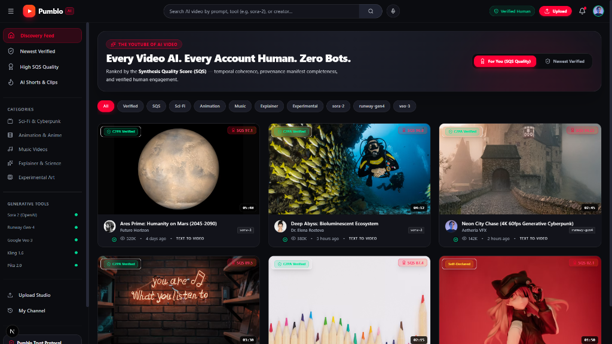

# Pumblo

### The YouTube of AI video.

**Every video is AI-generated. Every account is a real, verified human. Every ranking is earned — never bought.**


Live now: https://www.pumblo.ai — free to watch, free to join, open-source and self-hostable.


*The Discovery feed — ranked by the Synthesis Quality Score, not by who bought the most bots.*

Pumblo gives AI-generated film, animation, music video, and explainer content the same home YouTube gave camera footage twenty years ago — except every creator is a real, verified person, and every upload says exactly how it was made. Land on Pumblo to watch something great, laugh, learn something, or fall down a feed that was never optimized to waste your time.

- Watch — no account needed, exactly like YouTube
- Upload — from your browser, an API call, or a one-line shell command
- Trust — every account is a real person, every video is provably AI

---

## Table of Contents
- [About](#about)
- [Tags and Keywords](#tags-and-keywords)
- [Why Pumblo Exists](#why-pumblo-exists)
- [Who Pumblo Is For](#who-pumblo-is-for)
- [What Pumblo Is (and Isn't)](#what-pumblo-is-and-isnt)
- [How It Works](#how-it-works)
- [Signing Up: Email, Password, Proof of Humanity](#signing-up-email-password-proof-of-humanity)
- [Uploading: Browser, API, or Shell](#uploading-browser-api-or-shell)
- [Security Philosophy](#security-philosophy)
- [Marketing and SEO Philosophy](#marketing-and-seo-philosophy)
- [The Synthesis Quality Score](#the-synthesis-quality-score)
- [Trust, Safety, and Content Policy](#trust-safety-and-content-policy)
- [Handling Many Users at Once](#handling-many-users-at-once)
- [Launch Philosophy: Free to Run, Built to Scale](#launch-philosophy-free-to-run-built-to-scale)
- [Architecture](#architecture)
- [Getting Started (Self-Hosting)](#getting-started-self-hosting)
- [API and CLI Reference](#api-and-cli-reference)
- [Environment Variables](#environment-variables)
- [Repository Structure](#repository-structure)
- [Deployment](#deployment)
- [GitHub Releases](#github-releases)
- [Contributing](#contributing)
- [Code of Conduct](#code-of-conduct)
- [Security Policy](#security-policy)
- [License](#license)

---

## About

Pumblo is an open-source, human-accountable video platform designed specifically for AI-generated video. Built on Next.js, Node.js, C2PA Content Credentials, and PostgreSQL, Pumblo guarantees that every published video is provably AI-generated and every registered account belongs to a unique, verified human.

## Tags and Keywords

- ai-video
- c2pa
- provenance
- proof-of-humanity
- nextjs
- typescript
- synthesis-quality-score
- agplv3
- youtube-alternative
- open-source

---

## Why Pumblo Exists

AI-generated video doesn't have a home built for it. It has a moderation category on platforms designed around camera footage — inconsistent labeling, algorithmic suspicion of anything from a known AI creator, and real prompt-craft lumped in with low-effort spam because nothing on those platforms distinguishes the two.

Provenance is a solved problem almost nobody enforces. The C2PA Content Credentials standard already lets a generation tool cryptographically attach "how this was made" to a file. Almost no consumer platform validates that metadata, preserves it through re-encoding, or gives a creator any reason to keep it intact. Pumblo does both — validates it at upload, and rewards keeping it with full ranking weight.

Engagement-optimized ranking rewards the wrong thing. Train a feed to maximize watch time and click-through, and both are trivially inflatable with bots or a misleading thumbnail — quality becomes a losing strategy. It's a well-documented failure mode of nearly every major recommendation system running today. Pumblo's ranking formula deliberately excludes both signals.

Bots hollowed out likes and comments as trust signals. A comment section only means something if a human probably wrote it — on most platforms today, that's not a safe assumption anymore.

Nobody is accountable. Anonymous, disposable, and automated accounts make it trivial to publish and vanish. Pumblo's answer is structural, not a policy promise: one verified human per account, full stop.

## Who Pumblo Is For

- AI filmmakers and prompt artists who want an audience that judges the work, not a platform that buries it under a blanket "may be AI-generated" warning.
- Viewers who want a feed of genuinely good AI content — shorts, animation, music videos, experimental art — without wading through bot-inflated engagement bait to find it.
- Educators and explainer creators using AI video tools, who want to be ranked on clarity and accuracy, not thumbnail psychology.
- Anyone curious what AI video actually looks like right now, in one place, instead of scattered across Discord servers and subreddits.

The one-line promise the whole platform is built around: *every video is AI, every account is a real person, and nothing here is trying to waste your time.*

## What Pumblo Is (and Isn't)

**Pumblo is:**
- A consumer video platform for watching AI-generated video — text-to-video, image-to-video, video-to-video, or audio-to-video — laid out the way YouTube is, on purpose, because that's the interaction model people already know.
- Provenance-first: every published video is either cryptographically verified against a C2PA manifest or held for human moderation review before it can reach Discovery.
- Human-accountable: every account belongs to exactly one verified real person, responsible for what they publish.

**Pumblo is not:**
- A video generation tool. Bring a finished render from whatever tool made it — Pumblo doesn't train, host, or run a generative model.
- A home for real camera footage, including AI-upscaled or AI-restored real video. Out of scope, rejected at ingest.
- A place for anonymous or bot-operated accounts. There's no signup path — web or API — that skips human verification.

## How It Works

Pumblo copies the parts of YouTube people already know how to use, and changes only what needed changing.

**Discovery feed** — a single ranked homepage feed, filterable by generation tool/model, category (entertainment, animation, education, music, sci-fi), duration, and license. Toggle between *For You* (personalized within the quality-ranked pool) and *Newest Verified* (strict chronological order among fully provenance-verified uploads).

**Watch page** — familiar player chrome: title, description, likes, comments, related videos — plus a Provenance Panel unique to Pumblo showing which AI tool made the video, a verified/unverified provenance badge, the creator's Human-Verified badge, the license, and, if the creator opted in, the generation prompt.

**Channel page** — creator profile, upload history, subscriber count, plus a Human-Verified badge, account age, and a Consistency score: the share of a creator's uploads that passed provenance verification without a manual review.

**Search** — faceted by generation tool, mode, resolution, duration, license, and provenance status, because "only Sora uploads under two minutes with a verified manifest" is a query AI-video viewers actually make.

**Upload Studio** — drag-and-drop web uploader running on the exact same metadata schema as the API and CLI, with API key management built in.

## Signing Up: Email, Password, Proof of Humanity

Sign-up is email and password — deliberately the lowest-friction, most universally understood identity method, chosen over passkey-only or OAuth-only flows so a new creator isn't blocked by unfamiliar tech before they've even watched a video.

1. **Create an account** with an email and password. Passwords are never stored — only an `argon2id` hash.
2. **Verify the email.** An account can browse and watch immediately, but write access (upload, comment, like, subscribe) waits for a confirmed inbox.
3. **Clear a Proof-of-Humanity challenge** — a short, interactive, privacy-preserving bot check (Cloudflare Turnstile at launch, upgradable later to a liveness check) required once before the account touches Discovery.
4. **Receive a Human Trust Token** — a short-lived credential, silently refreshed as long as behavior stays human-shaped: normal request timing, no impossible-travel logins, no scripted patterns. An anomaly triggers a fresh challenge, not an instant ban — the goal is friction for bots, not friction for a person having a weird day.

Only uploading, commenting, liking, subscribing, and other write actions require a valid Human Trust Token. Browsing, watching, and searching never require an account.

## Uploading: Browser, API, or Shell

Every upload path runs through the same pipeline and requires the same thing underneath: a signed-in, human-verified account holding a valid Human Trust Token.

**Browser — Upload Studio**
Drag a file into `pumblo.ai/studio/upload`, fill in the fields below, publish.

**API — `POST /v1/videos`**
```bash
curl -X POST https://www.pumblo.ai/api/v1/videos \
  -H "Authorization: Bearer $PUMBLO_API_KEY" \
  -F "file=@render_final.mp4" \
  -F "title=Neon City Chase" \
  -F "generation_tool=runway-gen4" \
  -F "generation_mode=text-to-video" \
  -F "c2pa_manifest=@render_final.c2pa" \
  -F "depicts_real_person=false" \
  -F "license=cc-by-4.0"
```

**Shell — Pumblo CLI**
```bash
curl -fsSL https://get.pumblo.ai | sh

pumblo upload ./render_final.mp4 \
  --title "Neon City Chase" \
  --tool runway-gen4 \
  --mode text-to-video \
  --license cc-by-4.0 \
  --depicts-real-person=false
```

**Batch, for pipeline creators**
```bash
for f in ./renders/*.mp4; do
  pumblo upload "$f" \
    --title "$(basename "$f" .mp4)" \
    --tool auto-detect \
    --mode text-to-video \
    --license all-rights-reserved \
    --wait-for-verification
done
```

**Required metadata**

| Field | Required | Notes |
|---|---|---|
| `title` | Yes | Video title |
| `generation_tool` | Yes | e.g. `sora-2`, `runway-gen4`, `veo-3`, `kling-1.6`, `pika-2`, or `custom` with disclosure |
| `generation_mode` | Yes | `text-to-video`, `image-to-video`, `video-to-video`, `audio-to-video` |
| `c2pa_manifest` | Recommended | Unlocks the verified-provenance badge and full ranking weight |
| `depicts_real_person` | Yes (boolean) | `true` requires Consent Registry documentation before publish |
| `license` | Yes | `all-rights-reserved`, `cc-by-4.0`, `cc-by-nc-4.0`, `cc0` |
| `prompt_disclosure` | Optional | `public`, `private`, or `none` |

## Security Philosophy

Three rules shape every decision below: nothing sensitive ever travels in a URL, every write action is rate-limited before it reaches application code, and a session is a fact the server checks — never a fact the client asserts.

**Authentication.** Passwords are hashed with `argon2id`, never stored in reversible form. Login attempts are rate-limited with exponential backoff and temporary lockout after repeated failures. Password resets always route through the verified email, never through a support channel that could be socially engineered.

**Session integrity.** A session must never be reconstructable from a URL. Pumblo issues session identifiers only inside `HttpOnly`, `Secure`, `SameSite=Strict` cookies — never as a query parameter, path segment, or hash fragment. Copying a Pumblo URL and opening it in a different browser opens the same public page for anyone; it never carries someone else's identity with it. Every request is re-validated server-side against the session store, not just trusted because a cookie is present. Session identifiers rotate on login and on any privilege change, and logging out invalidates the session on the server immediately.

**Proof of Humanity vs. authentication.** An email/password login proves someone controls an inbox — it doesn't prove a human is behind the keyboard, and it doesn't stop one person from farming a hundred accounts. That's a separate, independent check, layered on top of authentication, not folded into it.

## Marketing and SEO Philosophy

Every watch page is a landing page. Server-rendered HTML tags, structured VideoObject data, canonical tags, and auto-generated sitemaps ensure search engine indexing and social media preview compatibility.

## The Synthesis Quality Score

Discovery ranking runs entirely on the Synthesis Quality Score (SQS), not on raw popularity:

```
SQS = (0.30 * TFS) + (0.20 * PCS) + (0.25 * HES) + (0.15 * CTS) + (0.10 * FDF) - MP

  TFS  Technical Fidelity Score       [0–100]
  PCS  Provenance Completeness Score  [0–100]
  HES  Human Engagement Score         [0–100]
  CTS  Creator Trust Score            [0–100]
  FDF  Freshness Decay Factor         [0–100, configurable half-life]
  MP   Moderation Penalty             [0–100, subtractive]

Hard rule: any video carrying an unresolved severe moderation flag is excluded from Discovery regardless of its SQS.
```

## Trust, Safety, and Content Policy

The verified human behind an account is the publisher of record for what they upload.

Prohibited content:
- Non-consensual depictions of a real, identifiable person without documented consent on file
- Child sexual abuse material in any form — zero tolerance, mandatory reporting
- Provenance metadata that's been stripped or falsified
- Hate speech, harassment, or incitement to violence
- Any camera-captured footage, including AI-upscaled or AI-restored real video

## Handling Many Users at Once

Stateless application design backed by Redis session storage, CDN edge caching, object storage for media delivery, and asynchronous background job queues.

## Launch Philosophy: Free to Run, Built to Scale

Built on serverless / free-tier infrastructure (Next.js, PostgreSQL, Cloudflare R2, Redis) that scales seamlessly without requiring rearchitecting.

## Architecture

```
User Browser --> Cloudflare Edge (CDN / WAF / DDoS)
                 --> Next.js Application Server
                     --> Session Store (Redis)
                     --> Database (PostgreSQL)
                     --> Media Storage (Cloudflare R2 / S3)
```

## Getting Started (Self-Hosting)

Prerequisites:
- Node.js 20+
- PostgreSQL
- Redis
- S3-compatible Object Storage

```bash
git clone https://github.com/IamOumarIbrahim/pumblo.git
cd pumblo
cp .env.example .env.local
npm install
npm run db:migrate
npm run dev
```

The app is available at http://localhost:3000.

Bootstrap owner account:
```bash
npm run create-owner -- --email you@example.com
```

## API and CLI Reference

REST API endpoints:
- POST /api/v1/auth/signup — Create account
- POST /api/v1/auth/login — Authenticate
- POST /api/v1/auth/verify — Proof of Humanity challenge
- POST /api/v1/videos — Upload video
- GET /api/v1/videos/:id — Fetch video metadata & SQS scores
- POST /api/v1/videos/:id/comments — Post comment
- GET /api/v1/channels/:handle — Fetch channel profile
- GET /api/v1/search — Faceted search

## Environment Variables

| Variable | Required | Description |
|---|---|---|
| `DATABASE_URL` | Yes | PostgreSQL connection string |
| `REDIS_URL` | Yes | Redis connection string |
| `SESSION_SECRET` | Yes | Session signing key |
| `R2_ACCOUNT_ID` / `R2_ACCESS_KEY_ID` / `R2_SECRET_ACCESS_KEY` / `R2_BUCKET` | Yes | Object storage credentials |
| `TURNSTILE_SITE_KEY` / `TURNSTILE_SECRET_KEY` | Yes | Proof of Humanity bot protection |
| `RESEND_API_KEY` | Yes | Email provider key |
| `NEXT_PUBLIC_APP_URL` | Yes | Canonical app URL |
| `C2PA_TRUST_LIST_URL` | No | Custom C2PA trust list URL |

## Repository Structure

```
pumblo/
├── app/                  # Next.js App Router & server
├── lib/
│   ├── auth/             # Session handling & Proof of Humanity
│   ├── provenance/       # C2PA manifest parsing
│   ├── quality/          # Technical Fidelity & SQS scoring
│   ├── moderation/       # Flag queue, strikes & consent registry
│   └── db/               # PostgreSQL schema & database adapter
├── jobs/                 # Background job queue handlers
├── cli/                  # Pumblo CLI executable source
├── packages/
│   ├── sdk-js/           # JavaScript API client
│   └── sdk-python/       # Python API client
├── public/               # Static assets
├── docs/                 # System & API documentation
├── CONTRIBUTING.md
├── CODE_OF_CONDUCT.md
├── SECURITY.md
└── LICENSE
```

## Deployment

Deploying Pumblo to production:

1. Push your repository to GitHub.
2. Connect your repository to a Next.js hosting platform (e.g. Vercel).
3. Configure production environment variables (`DATABASE_URL`, `REDIS_URL`, `SESSION_SECRET`, `R2_*`, `TURNSTILE_*`, `NEXT_PUBLIC_APP_URL`).
4. Execute `npm run db:migrate` against your production PostgreSQL instance.
5. Provision Cloudflare or equivalent CDN in front of your domain.

## GitHub Releases

Production releases follow Semantic Versioning (SemVer):

- `v1.0.0` — Initial production release including SQS Quality Engine, C2PA Provenance Parser, Proof of Humanity auth, REST API v1, and CLI.

Fetch official release bundles via GitHub CLI:
```bash
gh release download v1.0.0
```

## Contributing

Contributions of any size are welcome. Please see `CONTRIBUTING.md` for local setup, branch conventions, and contribution guidelines.

1. Fork the repo and create a feature branch (`git checkout -b feat/my-feature`).
2. Run local tests before submitting a pull request (`npm test`).
3. Trust-critical changes (auth, sessions, moderation) require opening a design discussion issue first.

## Code of Conduct

Pumblo follows the Contributor Covenant Code of Conduct. Please see `CODE_OF_CONDUCT.md` for our standards and enforcement policy.

## Security Policy

Security reports are taken seriously and should never be filed as public issues. Email `security@pumblo.ai` or submit a private security vulnerability report via GitHub. See `SECURITY.md` for full details.

## License

Pumblo is licensed under the GNU Affero General Public License v3.0 (AGPL-3.0). See `LICENSE` for the full license text.
