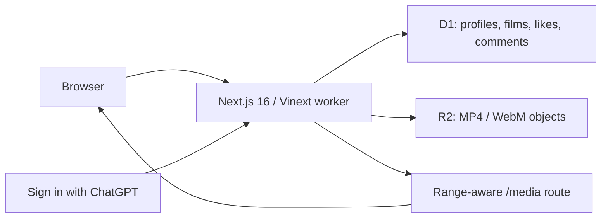

<div align="center">
  <h1>🎬 Pumblo</h1>
  <p><strong>The human-accountable home for AI-generated video.</strong></p>

  [](https://www.typescriptlang.org/)
  [](LICENSE)
  [](https://github.com/IamOumarIbrahim/pumblo/actions/workflows/ci.yml)
  <br />
  [](https://nextjs.org/)
  [](https://github.com/cloudflare/vinext)
  [](#-setup--installation)
  <br />
  **[Open the live beta](https://pumblo-ai-video.oumaribrahim123.chatgpt.site)**
</div>

<p align="center">
  
</p>

> [!IMPORTANT]
> **No card setup**: local development and the configured Sites deployment require no database account, storage account, API key, or payment card. Production identity, D1 records, and R2 video storage are managed by the hosting platform.

Pumblo is a working small-beta video community for finished AI-generated films. People sign in with ChatGPT, create a public creator profile, upload an MP4 or WebM, watch creator channels, and save likes and comments. The release deliberately caps itself at 10 profiles and five videos per profile so its first community fits inside the managed free-tier footprint.

```bash
# Quickstart - Windows PowerShell
git clone https://github.com/IamOumarIbrahim/pumblo.git
cd pumblo
.\scripts\setup.ps1
npm run dev
```

## 📖 Table of Contents

- [What is Pumblo?](#-what-is-pumblo)
- [Key Features](#-key-features)
- [System Architecture](#️-system-architecture)
- [Setup & Installation](#-setup--installation)
- [How to Use](#️-how-to-use)
- [Runtime Reference](#-runtime-reference)
- [Scope & Limitations](#-scope--limitations)
- [File Structure](#-file-structure)
- [Troubleshooting](#-troubleshooting)
- [Contributing](#-contributing)
- [License](#-license)

---

## 💡 What is Pumblo?

General video platforms treat AI media as one content label among many. Pumblo makes the creation process part of every film page: generation tool, mode, category, license, optional prompt notes, and an explicit provenance state.

Instead of requiring a stack of separately billed services, Pumblo uses one edge deployment:

- **Accountability**: production writes require Sign in with ChatGPT, while public viewing remains open.
- **Durability**: profiles, film metadata, likes, comments, and view counts live in D1.
- **Playback**: video bytes live in R2 and support HTTP byte-range requests.
- **Honest provenance**: this beta labels uploads as `self-declared`; it does not pretend to perform C2PA verification.

---

## ✨ Key Features

- 👤 **Creator profiles**: unique handle, display name, bio, location, website, and profile color.
- ⬆️ **Streaming uploads**: MP4 or WebM files up to 90 MB stream directly into R2 without multipart buffering.
- ▶️ **Real playback**: watch pages support browser seeking through `206 Partial Content` responses.
- 💬 **Community actions**: one persisted like per person/video plus 500-character comments.
- 🔎 **Discovery**: search by title, description, or generation tool; filter by category; sort by newest or the beta quality score.
- 🔐 **Private identity**: public profiles never expose the email supplied by the hosting authentication layer.
- 🧪 **Safe local testing**: a development-only identity route makes two-user acceptance testing possible without credentials.

---

## ⚙️ System Architecture

The browser talks to a single Vinext worker; the hosting platform injects identity and provisions both durable bindings.



> [!NOTE]
> **Why the raw upload body?** The film is sent as the request body and its validated metadata travels in a bounded header. This lets the worker stream bytes into R2 instead of holding a large multipart file in memory.

---

## 🚀 Setup & Installation

### Option A: Automated setup

Windows PowerShell:

```powershell
.\scripts\setup.ps1
```

macOS / Linux:

```bash
chmod +x scripts/setup.sh
./scripts/setup.sh
```

The script verifies Node.js, installs the exact lockfile, runs linting and type checks, executes release tests, and produces a deployment build.

### Option B: Manual installation

Requirements: Node.js 22.13 or newer and npm.

```bash
npm ci
npm run verify
npm run dev
```

No `.env` values are required. Vinext creates local D1 and R2 data under `.wrangler/`.

🔍 **Verification command**:

```bash
npm run verify
```

Expected result: ESLint, TypeScript, seven release tests, and the Vinext production build all complete successfully.

### Production deployment

The checked-in [`.openai/hosting.json`](.openai/hosting.json) is already bound to the Pumblo Sites project and declares:

```json
{
  "d1": "DB",
  "r2": "MEDIA"
}
```

Deploy through Codex Sites. It provisions the managed bindings, runs the included Drizzle migrations, enables Sign in with ChatGPT, and serves the saved version at the edge. There is no registrar, database, storage, email, OAuth, or payment-card setup in this path.

Current production deployment: **[pumblo-ai-video.oumaribrahim123.chatgpt.site](https://pumblo-ai-video.oumaribrahim123.chatgpt.site)**

---

## 🖥️ How to Use

### Production

1. Open Pumblo and browse without signing in.
2. Choose **Sign in** and authenticate with a ChatGPT account.
3. Create a public Pumblo profile.
4. Open **Upload**, choose an MP4/WebM, complete the AI disclosure, and publish.
5. Use a second ChatGPT account to simulate another person, then watch, like, comment, and edit that second profile.

### Local two-user acceptance test

Start the app, then visit these development-only URLs:

```text
http://localhost:3000/api/dev-session?email=alice@example.test
http://localhost:3000/api/dev-session?email=bob@example.test
```

Each URL switches the local test identity and redirects to profile setup. The route returns `404` in production builds.

---

## 📊 Runtime Reference

| Resource | Binding / limit | Purpose |
| :--- | :--- | :--- |
| Profiles | 10 total | Keeps the beta inside its intended first-user footprint |
| Videos | 5 per profile | Prevents one creator from consuming the full storage pool |
| Video file | MP4 or WebM, 90 MB max | Browser-ready source stored without transcoding |
| Database | D1 binding `DB` | Profiles, metadata, likes, comments, views |
| Media | R2 binding `MEDIA` | Durable video objects and range reads |
| Authentication | Sign in with ChatGPT | Production write identity |
| Provenance | `self-declared` | Creator disclosure; no cryptographic verification yet |

Public HTTP endpoints are documented in [`docs/api.md`](docs/api.md).

---

## 🔬 Scope & Limitations

- **No uptime SLA**: the deployment has no sleeping application process, but availability remains subject to the hosting service and its free-tier policies.
- **Small beta by design**: the app stops accepting new profiles after 10. It is not configured for an unrestricted public launch.
- **No transcoding**: upload browser-ready H.264 MP4 or WebM files. Pumblo serves the original object.
- **No cryptographic provenance yet**: uploads are visibly marked `self-declared`; C2PA validation is future work.
- **No automated moderation pipeline**: the disclosure policy is enforced in the UI, not by media forensics. Do not use this beta for an untrusted open signup.
- **One identity provider**: production profile creation and writes require a ChatGPT account.

---

## 📁 File Structure

```text
pumblo/
├── .openai/hosting.json       - Sites project plus D1/R2 declarations
├── app/                       - Pages, components, auth adapter, and API routes
│   ├── api/                   - Profile, video, like, and comment writes
│   ├── media/[id]/            - Range-aware video delivery
│   ├── profile/[handle]/      - Public creator channels
│   ├── settings/profile/      - Create and edit a profile
│   ├── upload/                - Upload Studio
│   └── watch/[id]/            - Film player and conversation
├── db/                        - D1 schema and typed persistence functions
├── drizzle/                   - Production database migrations
├── public/                    - Static social-preview asset
├── scripts/                   - Automated Windows and POSIX setup
├── tests/                     - Release-contract tests
├── worker/                    - Vinext worker entrypoint
└── vite.config.ts             - Local and production binding configuration
```

---

## 🩹 Troubleshooting

| Issue | Root Cause | Resolution |
| :--- | :--- | :--- |
| `Node.js 22.13.0 or newer` | The runtime is too old | Install current Node.js 22 LTS or newer, then rerun setup |
| Port 3000 is occupied | Another local app is listening | Run `npm run dev -- --port 3001` and use that printed URL |
| Upload rejected | Wrong format, over 90 MB, or profile missing | Create a profile; export H.264 MP4/WebM below 90 MB |
| Production asks for sign-in | The action writes data | Complete Sign in with ChatGPT, then return to the action |
| Local data needs a clean slate | Miniflare persists under `.wrangler/` | Stop the dev server and remove only this repo's `.wrangler/` directory |

---

## 🧩 Contributing

Run `npm run verify` before opening a pull request. The most useful next contributions are media moderation, thumbnail generation, C2PA verification with an explicit trust policy, and automated browser acceptance tests.

---

## 📄 License

AGPL-3.0-only © 2026 [Oumar Ibrahim](https://github.com/IamOumarIbrahim)

## 🙏 Powered By

[Next.js](https://nextjs.org/) · [Vinext](https://github.com/cloudflare/vinext) · [Drizzle ORM](https://orm.drizzle.team/) · [Cloudflare D1](https://developers.cloudflare.com/d1/) · [Cloudflare R2](https://developers.cloudflare.com/r2/)

<div align="center">

If Pumblo gives AI filmmakers a more honest home, a ⭐ helps other people find it.

</div>
