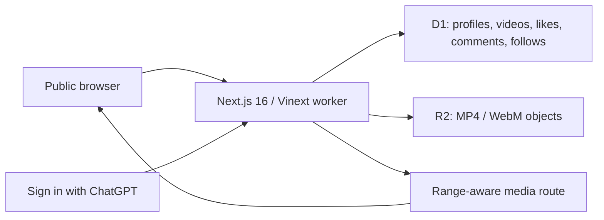

<div align="center">
  <h1>🎬 Pumblo</h1>
  <p><strong>AI video. Nothing else.</strong></p>
  <p>A public video-sharing platform for watching, uploading, searching, and interacting with AI-made video.</p>

  [](https://www.typescriptlang.org/)
  [](LICENSE)
  [](https://github.com/IamOumarIbrahim/pumblo/actions/workflows/ci.yml)
  <br />
  [](https://nextjs.org/)
  [](https://github.com/cloudflare/vinext)
  [](#-capacity--hosting)
  <br />
  <strong><a href="https://pumblo-ai-video.oumaribrahim123.chatgpt.site">Open the live platform</a></strong>
</div>

<p align="center">
  
</p>

> [!IMPORTANT]
> **No card setup path.** Local development needs no API keys. The checked-in Sites project supplies production authentication plus managed D1 and R2 bindings. Hosting is not claimed to be free forever; quotas and availability remain platform-controlled.

Pumblo is for people who make and watch AI video. It behaves like a focused video network: a public feed, searchable videos and creators, channel pages, likes, comments, follows, and a Following feed. A creator can optionally attach tools, workflow, license, and process notes under **Behind the render**—useful context, but not the main product.

```powershell
# Quickstart — Windows PowerShell
git clone https://github.com/IamOumarIbrahim/pumblo.git
cd pumblo
.\scripts\setup.ps1
npm run dev
```

## 📖 Table of Contents

- [What is Pumblo?](#-what-is-pumblo)
- [Key Features](#-key-features)
- [System Architecture](#️-system-architecture)
- [Setup & Installation](#-setup--installation)
- [How to Use](#️-how-to-use)
- [Product Gates](#-product-gates)
- [Capacity & Hosting](#-capacity--hosting)
- [Runtime Reference](#-runtime-reference)
- [Scope & Limitations](#-scope--limitations)
- [File Structure](#-file-structure)
- [Troubleshooting](#-troubleshooting)
- [Contributing](#-contributing)
- [License](#-license)

---

## 💡 What is Pumblo?

General video platforms mix AI work into everything else; generation tools often stop at rendering or expose only tool-specific galleries. Pumblo gives AI video its own public, cross-tool network.

Instead of making a process page the destination, Pumblo puts the video and audience loop first:

- **Watch and discover**: public trending, latest, category, search, and Following feeds.
- **Publish a channel**: each creator gets a searchable public profile and canonical video URLs.
- **Interact**: persisted likes, comments, and follows connect viewers to creators.
- **Inspect the process**: an optional creator-declared card records tools, workflow, license, and notes.

---

## ✨ Key Features

- 🔎 **Queryable discovery**: search video titles, descriptions, tools, creator handles, display names, and public profiles.
- ▶️ **Public playback**: anyone can watch; `/media/:id` supports HTTP range requests for seeking.
- ⬆️ **Streaming uploads**: MP4/WebM bodies stream directly into R2 instead of being buffered as multipart data.
- 👤 **Creator channels**: handle and display name are the only required profile fields.
- 💚 **Audience loop**: one like per profile/video, comments up to 500 characters, follows, follower counts, and a personal Following feed.
- 🧹 **Capacity recovery**: owners can delete a video and its likes/comments to free an upload slot.
- 🧰 **Behind the render**: free-text tool input, five workflow modes, licensing, and optional process notes.
- 🔗 **Search-engine surfaces**: canonical metadata, `VideoObject` structured data, creator/video sitemap entries, robots rules, manifest, and a 1200 × 630 share card.
- 🔐 **Private identity**: authenticated email addresses never render on public pages.

---

## ⚙️ System Architecture

The browser talks to one edge worker. The deployment platform supplies identity, D1, and R2.



> [!NOTE]
> **Raw upload bodies are deliberate.** Validated metadata travels in a bounded header while the video body streams to object storage. The worker does not first load a multipart video into memory.

See [`docs/architecture.md`](docs/architecture.md) for the data path and trust boundary.

---

## 🚀 Setup & Installation

### Option A: Automated setup

Windows PowerShell:

```powershell
.\scripts\setup.ps1
```

macOS / Linux:

```bash
chmod +x scripts/setup.sh
./scripts/setup.sh
```

Both scripts check Node.js, install the lockfile, run release gates, and build the worker.

### Option B: Manual installation

Requirements: Node.js 22.13 or newer and npm.

```bash
npm ci
npm run verify
npm run dev
```

No `.env` is required. Local D1/R2 state lives under this repository's `.wrangler/` directory.

🔍 **Verification command**

```bash
npm run verify
```

Expected result: ESLint, TypeScript, 21 release/unit tests, the production dependency audit, and the Vinext production build pass.

### Production deployment

The checked-in [`.openai/hosting.json`](.openai/hosting.json) is bound to the existing Pumblo Sites project with D1 as `DB` and R2 as `MEDIA`. Deploy through Codex Sites; the configured path does not ask the repository user to open a registrar, database, storage, OAuth, or payment-card account.

Live domain: **[pumblo-ai-video.oumaribrahim123.chatgpt.site](https://pumblo-ai-video.oumaribrahim123.chatgpt.site)**

---

## 🖥️ How to Use

1. Browse or search AI videos without signing in.
2. Choose **Upload video**, authenticate, and claim a creator handle.
3. Upload a browser-ready MP4/WebM up to 40 MB.
4. Add the generation tool and disclosure; process notes are optional.
5. Open a second account to watch, like, comment, follow the creator, and return through the Following feed.
6. From an owned watch page, delete a video to reclaim one of the two active slots.

For a local two-person acceptance test:

```text
http://localhost:3000/api/dev-session?email=alice@example.test
http://localhost:3000/api/dev-session?email=bob@example.test
```

The helper route returns `404` outside development.

---

## 🚪 Product Gates

Every market-facing change must survive one blunt question: **“Bro, who's even gonna use this?”**

| Gate | Shipping test |
| :--- | :--- |
| Named audience | Does this help someone making or watching AI video now? |
| Core loop | Can people watch, upload, search, and interact? |
| Cold start | Does an empty feed honestly point to the first upload? |
| Low friction | Can anyone watch, and can a creator ship without third-party setup? |
| Honest trust | Are claims limited to authenticated identity and creator declarations? |
| Distribution | Are public videos and channels canonical, searchable, and shareable? |
| Evidence | Do automated gates and production probes enforce the promise? |

Full criteria: [`docs/PRODUCT-GATES.md`](docs/PRODUCT-GATES.md). Checked claims: [`docs/FACT-CHECK.md`](docs/FACT-CHECK.md).

### Trending order

Trending uses observable activity instead of a fabricated art grade:

```text
trending points = 6 × likes + 4 × comments + 0.05 × min(views, 500)
```

Newest publication time breaks ties. The formula ranks activity, not artistic quality.

---

## 📊 Capacity & Hosting

The launch envelope is explicit and test-enforced:

```text
100 creators × 2 active videos × 40 MiB = 8,000 MiB maximum media payload
```

There is no application-level signup cap; “100 creators” is a capacity target, not a user-101 lockout. Owner deletion returns storage and an upload slot.

Current official free-plan research shows why the existing Sites-managed D1/R2 route is retained:

| Option | Published free allowance / constraint | Pumblo decision |
| :--- | :--- | :--- |
| Cloudflare R2 | 10 GB-month Standard storage and free egress; direct setup has an R2 subscription/checkout flow | Capacity benchmark; Sites manages the binding |
| Cloudflare D1 | 5 GB total on Free plus daily read/write allowances | More than enough for launch metadata |
| Cloudflare Stream | Usage-priced, not free | Rejected for no-card launch |
| Supabase Free | 1 GB storage and 5 GB egress | Too small for the 8,000 MiB envelope |
| Vercel Blob Hobby | 1 GB storage and 10 GB transfer | Too small |
| Firebase Storage | Requires Blaze billing for current default-bucket access | Rejected |
| Cloudinary Free | No card and 25 shared monthly credits across storage/bandwidth/transforms | Valid fallback, but adds an external account and a volatile shared media budget |

Sources and caveats: [`docs/HOSTING-100-USERS.md`](docs/HOSTING-100-USERS.md).

---

## 📋 Runtime Reference

| Resource | Limit / behavior | Purpose |
| :--- | :--- | :--- |
| Profiles | No application-level signup cap | Avoid an artificial growth barrier |
| Videos | 2 active per creator | Bound launch storage; deletion recovers slots |
| Video file | MP4 or WebM, 40 MB maximum | Browser-ready source; no transcoding |
| Database | D1 binding `DB` | Profiles, metadata, likes, comments, follows, views |
| Media | R2 binding `MEDIA` | Durable objects and byte-range reads |
| Authentication | Sign in with ChatGPT | Required for writes, never for viewing |
| Process status | `creator-declared` | Disclosure, not cryptographic verification |

Public HTTP endpoints: [`docs/api.md`](docs/api.md).

---

## 🔬 Scope & Limitations

- **No uptime or free-forever promise**: availability, quotas, and pricing remain platform-controlled.
- **No transcoding or generated thumbnails**: upload a browser-compatible H.264 MP4 or WebM; the original object is served.
- **No cryptographic provenance**: Pumblo does not validate C2PA Content Credentials or prove pixel origin.
- **No mature moderation system**: reporting, appeals, automated media moderation, and incident response are required before a large untrusted launch.
- **No creator analytics dashboard**: public view/like/comment counts exist, but private analytics do not.
- **One production identity provider**: write actions currently use Sign in with ChatGPT.
- **Capacity target, not concurrency proof**: the storage model covers 100 creators; it is not a 100-simultaneous-upload load-test claim.

---

## 📁 File Structure

```text
pumblo/
├── .openai/hosting.json       - Sites project and D1/R2 declarations
├── app/                       - UI, authentication, pages, and HTTP routes
│   ├── api/                   - Profile, video, follow, like, comment, delete
│   ├── following/             - Signed-in following feed
│   ├── media/[id]/            - Range-aware video delivery
│   ├── profile/[handle]/      - Public creator channels
│   ├── upload/                - Publishing flow
│   └── watch/[id]/            - Playback, interaction, and process context
├── db/                        - D1 schema and persistence functions
├── docs/                      - Architecture, facts, hosting, gates, API, policy
├── drizzle/                   - Packaged database migrations
├── public/og.png              - 1200 × 630 social card
├── scripts/                   - Automated Windows and POSIX setup
├── tests/                     - Product contracts, capacity, and ranking tests
└── worker/                    - Vinext worker entry point
```

---

## 🩹 Troubleshooting

| Issue | Root cause | Resolution |
| :--- | :--- | :--- |
| Node version error | Runtime is older than 22.13 | Install Node.js 22.13+ and rerun setup |
| Port 3000 is occupied | Another local app is listening | Run `npm run dev -- --port 3001` |
| Upload is rejected | Missing profile, wrong format, over 40 MB, or both active slots are used | Create a profile, export MP4/WebM under 40 MB, or delete an owned video |
| Production asks for sign-in | The action changes data | Authenticate, then return to the action |
| Local state should be reset | Miniflare persists data | Stop the server and remove only this repo's `.wrangler/` directory |

---

## 🧩 Contributing

Run `npm run verify` before opening a pull request. High-value contributions include reporting/appeals, thumbnail generation, creator analytics, accessible player controls, and C2PA inspection backed by an explicit trust policy.

---

## 📄 License

AGPL-3.0-only © 2026 [Oumar Ibrahim](https://github.com/IamOumarIbrahim)

## 🙏 Powered By

[Next.js](https://nextjs.org/) · [Vinext](https://github.com/cloudflare/vinext) · [Drizzle ORM](https://orm.drizzle.team/) · [Cloudflare D1](https://developers.cloudflare.com/d1/) · [Cloudflare R2](https://developers.cloudflare.com/r2/)

<div align="center">

If an AI-only video network should exist in public, a ⭐ helps its first creators find it.

</div>
