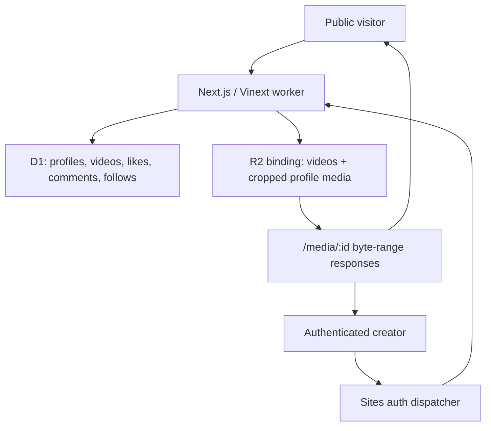

# Architecture Overview

Pumblo is one Vinext worker deployed through Sites. There is no separate database server, Redis service, object-storage account, email provider, or custom OAuth application.

The worker runs idempotent `CREATE TABLE IF NOT EXISTS` statements before data access and adds missing columns for an existing deployment. Drizzle migration files are also packaged for deployment; migration `0003` adds profile image references and verified video duration.

The production auth adapter reads dispatcher-provided email and optional display-name headers. A development-only HttpOnly cookie replaces those headers for local multi-person testing; its issuing route returns `404` in production.

Public pages expose canonical metadata, `VideoObject` JSON-LD, a creator/video sitemap, a robots policy, and progressive native/clipboard sharing.

Discovery has two independent paths:

- **Trending / Latest**: SQL orders persisted video activity or publication time.
- **Following**: an indexed `follows` relation filters videos by creators the viewer explicitly selected.
- **Quicks**: newest-first offset pages filter persisted duration to greater than zero and strictly below 60 seconds; the browser uses scroll snapping, intersection observation, keyboard controls, and on-screen step buttons.

Search queries titles, descriptions, tools, creator handles, creator display names, and public profile fields. The public `/api/videos` and `/api/profiles` routes expose the same query surface.

Trending activity is calculated from persisted likes, comments, capped views, and publication time. The legacy `sqs_score` database column remains only for migration compatibility and is never selected or displayed.

The storage boundary is centralized in `app/lib/limits.ts`: two active videos per creator at 40 MiB each, two cropped profile images at 3 MiB each, and a documented 100-creator launch target. Deleting an owned video first removes the R2 object and then its comments, likes, and D1 record. Profile media stores immutable objects behind mutable D1 references, so replacing or removing an image never requires a public object URL.

Guests can render every discovery, channel, media, and watch route. The dispatcher-owned Sign in with ChatGPT flow is invoked only when a visitor attempts a write such as upload, like, comment, or follow. No application password or separate OAuth secret is stored.
