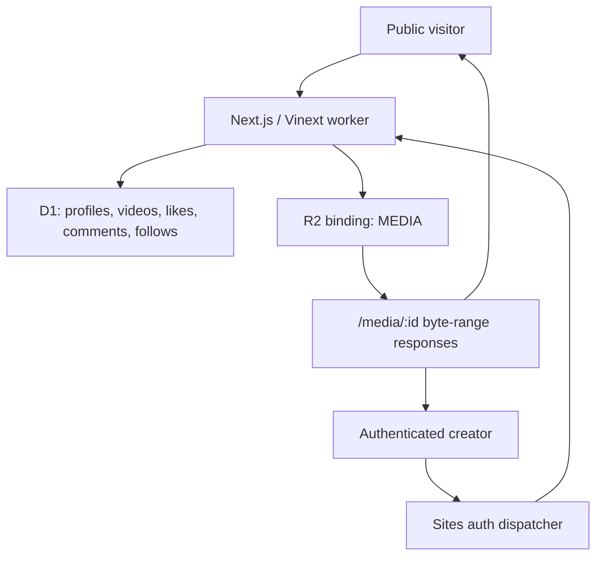

# Architecture Overview

Pumblo is one Vinext worker deployed through Sites. There is no separate database server, Redis service, object-storage account, email provider, or custom OAuth application.

The worker runs idempotent `CREATE TABLE IF NOT EXISTS` statements before data access. Drizzle migration files are also packaged for deployment; migration `0002` adds follows and its creator/follower indexes.

The production auth adapter reads dispatcher-provided email and optional display-name headers. A development-only HttpOnly cookie replaces those headers for local multi-person testing; its issuing route returns `404` in production.

Public pages expose canonical metadata, `VideoObject` JSON-LD, a creator/video sitemap, a robots policy, and progressive native/clipboard sharing.

Discovery has two independent paths:

- **Trending / Latest**: SQL orders persisted video activity or publication time.
- **Following**: an indexed `follows` relation filters videos by creators the viewer explicitly selected.

Search queries titles, descriptions, tools, creator handles, creator display names, and public profile fields. The public `/api/videos` and `/api/profiles` routes expose the same query surface.

Trending activity is calculated from persisted likes, comments, capped views, and publication time. The legacy `sqs_score` database column remains only for migration compatibility and is never selected or displayed.

The storage boundary is centralized in `app/lib/limits.ts`: two active videos per creator, 40 MiB each, and a documented 100-creator launch target. Deleting an owned video first removes the R2 object and then its comments, likes, and D1 record.
