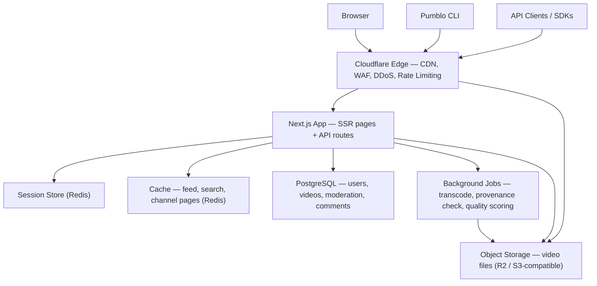

# Architecture Overview

Pumblo architecture is stateless at the app tier and relies on PostgreSQL, Redis, and Object Storage (R2/S3).

```mermaid
flowchart TD
    U["Browser"] --> CF["Cloudflare Edge — CDN, WAF, DDoS, Rate Limiting"]
    CLI["Pumblo CLI"] --> CF
    SDK["API Clients / SDKs"] --> CF
    CF --> APP["Next.js App — SSR pages + API routes"]
    APP --> SESS["Session Store (Redis)"]
    APP --> CACHE["Cache — feed, search, channel pages (Redis)"]
    APP --> DB["PostgreSQL — users, videos, moderation, comments"]
    APP --> JOBS["Background Jobs — transcode, provenance check, quality scoring"]
    JOBS --> STORE["Object Storage — video files (R2 / S3-compatible)"]
    APP --> STORE
    CF --> STORE
```
