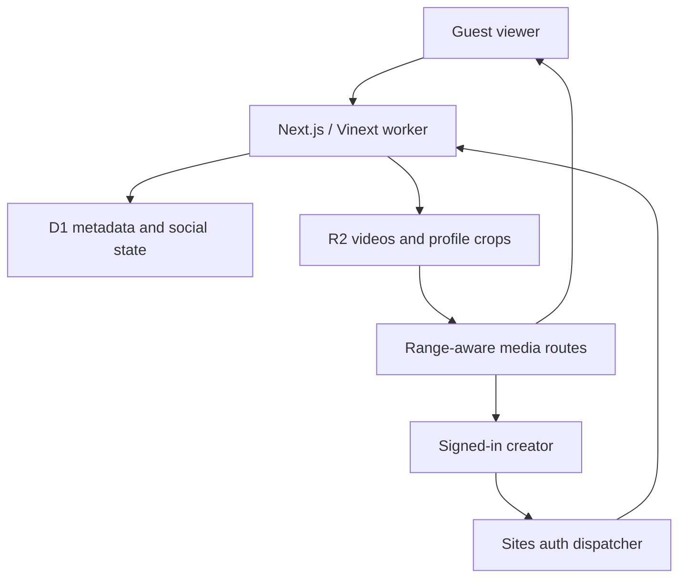
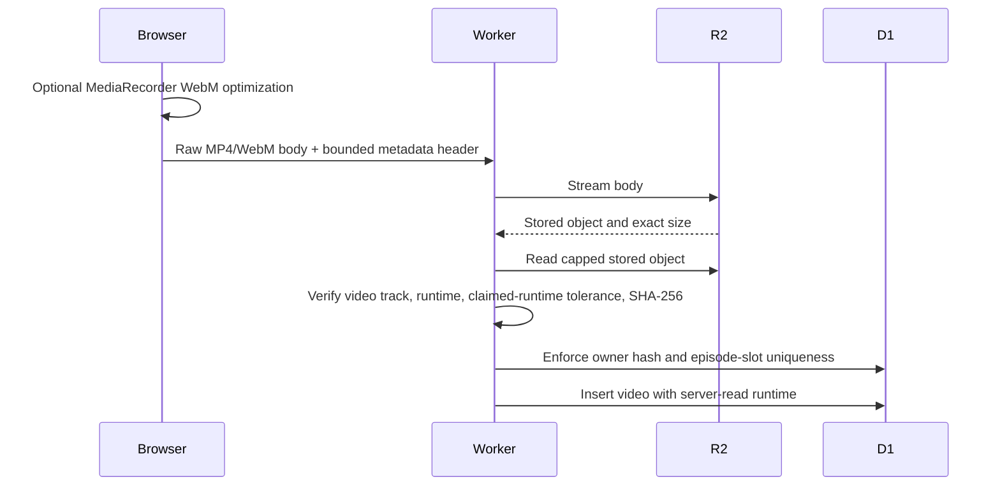

# Architecture Overview

Pumblo is one Next.js/Vinext edge worker deployed through Sites. There is no separate application server, database host, Redis service, email provider, custom OAuth application, or video-processing worker.

## Data model

D1 stores:

- profiles and public creator links;
- per-profile playback, content, notification, and privacy settings;
- series plus season/episode references;
- video metadata and server-read duration/hash evidence;
- likes, comments, follows, views, Watch Later, and playback progress;
- activity notifications and viewer reports.

R2 stores final published MP4/WebM objects and cropped avatar/banner images. Videos are served through `/media/:id` with byte ranges; profile media is served through stable handle-based routes backed by mutable D1 references.

The worker runs idempotent runtime schema checks before access so an existing deployment receives missing columns/tables. Drizzle migrations remain packaged as the auditable schema history: `0004` adds series/settings/library/activity/reporting and `0005` adds duplicate-file hashing.

## Upload and verification path

The request is never parsed as multipart video data. Final objects are capped at 40 MiB, so post-storage container inspection remains bounded. MP4 inspection reads `moov`/`mvhd` metadata and requires a `vide` handler; WebM inspection requires a supported video codec and reads declared duration or cluster timestamps. A mismatch deletes the stored object before metadata publication.

The browser optimizer accepts sources up to 200 MiB, re-encodes in real time using supported WebM MediaRecorder codecs, and keeps the output only when it is more than 8% smaller and its browser-read runtime remains within tolerance. The worker still applies all final file, storage, track, runtime, and duplicate checks.

## Discovery and viewing

- **Trending / Latest**: SQL orders persisted community activity or publication time.
- **Following**: an indexed relationship filters videos to selected creators.
- **Quicks**: offset pages include server-read runtimes greater than zero and strictly below 60 seconds.
- **Series**: ordered season/episode pages and optional next-episode autoplay.
- **Prefer stories**: a viewer setting can place series work ahead of standalone videos without changing community scores.
- **Hover preview**: video cards request unmuted inline playback after pointer entry, then fall back to muted playback and an explicit sound control when autoplay policy requires it.
- **Library**: Watch Later and incomplete watch progress are private to the signed-in profile.

## Story Tier trust boundary

Story Tier is computed from persisted series IDs, season/episode numbers, server-read runtimes, and server timestamps. D1 prevents two videos from occupying the same series/season/episode slot, and the owner/hash index prevents one creator from submitting the exact same bytes repeatedly.

The grade is deliberately structural. It does not measure artistic quality, identity, originality, truth, consent, popularity, or whether a plot is genuinely coherent.

## Identity and privacy

Production identity comes from dispatcher-provided Sign in with ChatGPT headers. A development-only HttpOnly cookie supports local multi-person testing; its issuing route returns `404` in production.

Guests can render discovery, profile, series, media, and watch routes. Authentication is requested only for mutations or private pages. Emails, object keys, and content hashes are removed from public API objects. Profile owners can hide location, creator links, and follower counts. JSON export contains the owner's state but replaces other users' emails with public handles.
