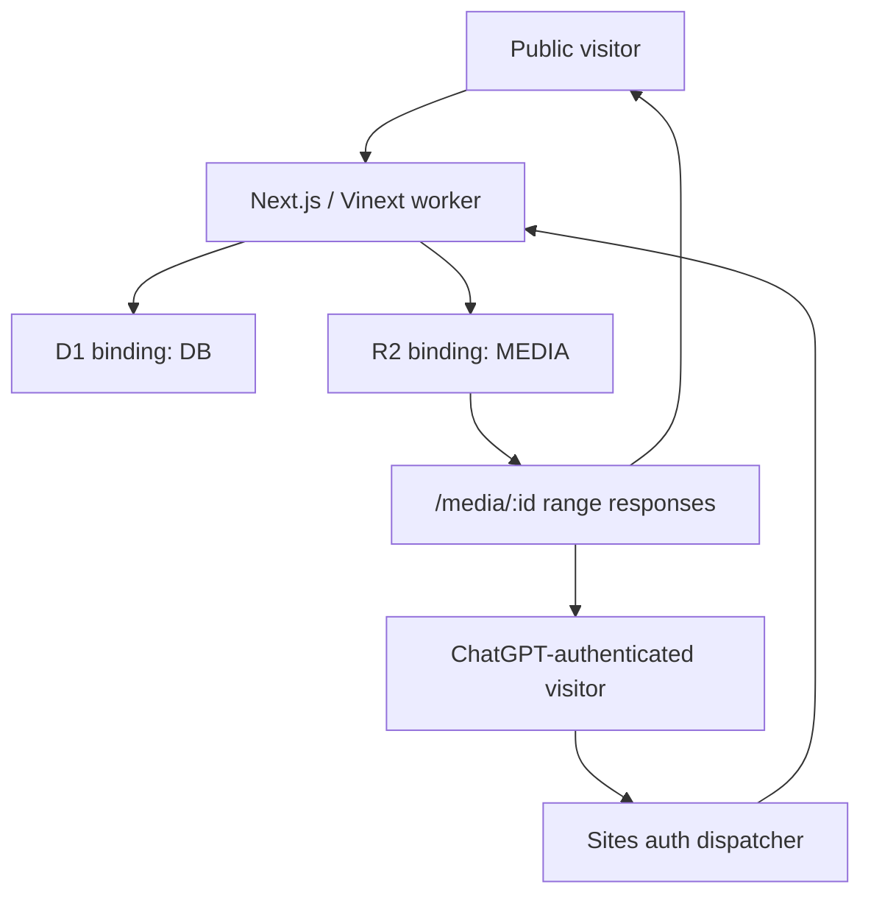

# Architecture Overview

Pumblo is one Vinext worker deployed through Sites. There is no separate database server, Redis service, object-storage account, email provider, or custom OAuth application.

The worker runs idempotent `CREATE TABLE IF NOT EXISTS` statements before data access. Drizzle migration files are also packaged with the deployment for platform provisioning.

The production auth adapter reads dispatcher-provided email and optional display-name headers. A development-only HttpOnly cookie replaces those headers for local two-person testing; its issuing route returns `404` in production.

Public pages expose canonical metadata, route-specific Open Graph data, a sitemap, and a robots policy. Film sharing is client-side progressive enhancement: native Web Share when present and the Clipboard API otherwise.

Community discovery is calculated from persisted likes, comments, capped views, and publication time. The legacy `sqs_score` database column remains only for migration compatibility and is neither selected nor shown by the product.
